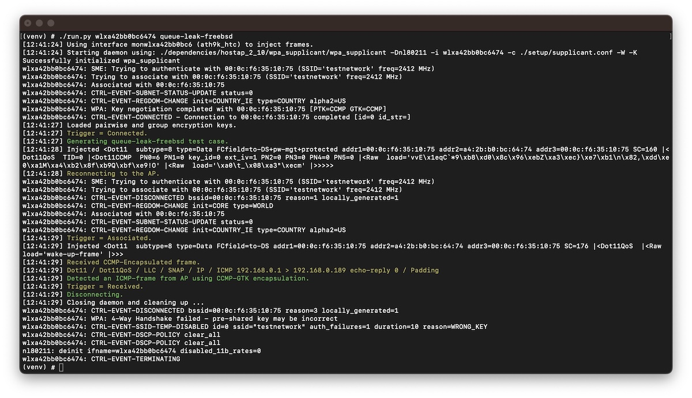
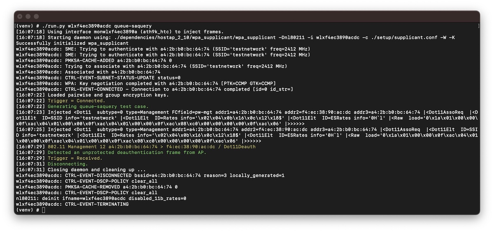

# Wi-Fi Framing

This repository summarizes information for the *'Framing Frames'* publication at [USENIX Security 2023](https://www.usenix.org/conference/usenixsecurity23/presentation/schepers) ([pdf](https://papers.mathyvanhoef.com/usenix2023-wifi.pdf)).

Furthermore, we provide proof-of-concepts implemented as test cases for the [Wi-Fi Framework](https://github.com/domienschepers/wifi-framework):
* [Leaking Frames from the FreeBSD Queue](#leaking-frames-from-the-freebsd-queue).
* [Queueing SA Query Requests](#queueing-sa-query-requests).

## Wi-Fi Client Isolation Bypass

The [MacStealer](https://github.com/vanhoefm/macstealer) repository provides a tool to test Wi-Fi networks for **client isolation bypasses (CVE-PENDING). Our attack can intercept (steal) traffic toward other clients at the MAC layer**, even if clients are prevented from communicating with each other.

More information is available on the [MacStealer: Wi-Fi Client Isolation Bypass](https://github.com/vanhoefm/macstealer) repository.

## Leaking Frames from the FreeBSD Queue

As a proof-of-concept we provide a test case for the [Wi-Fi Framework](https://github.com/domienschepers/wifi-framework) (see [usage instructions](https://github.com/domienschepers/wifi-framework/blob/master/docs/USAGE.md) - tested with commit [1f0a7f71](https://github.com/domienschepers/wifi-framework/commit/1f0a7f7137089e772e2481a130bd09701acfca0c)).

#### Description

In this [test case](framework/test-queue-leak-freebsd.py), we transmit an encrypted echo request frame with the sleep-bit set causing its echo reply frame to be buffered by the access point.
We then start an optimized reconnection (that is, skipping authentication) and after the association (that is, prior to the 4-Way handshake) we wake up the client with an arbitrary frame without setting the sleep-bit.
Since we did not yet derive a new pairwise encryption key using the 4-Way handshake, the buffered data (in this case an echo reply frame) should not be transmitted.
However, since the FreeBSD AP leaks frames by falling back on the group encryption key, we can now listen for such frames using the group key from our first session and verify if the access point is vulnerable.

#### Patch

The following commit prevents FreeBSD from falling back on the multicast encryption key:
- [net80211: fail for unicast traffic without unicast key](https://github.com/freebsd/freebsd-src/commit/61605e0ae5d8f34b89b8e71e393f3006f511e86a)

#### Start the FreeBSD Access Point

First, we need to set up a FreeBSD AP.
A configuration file for WPA2-Personal is provided in [freebsd-hostapd.conf](framework/freebsd-hostapd.conf).

To start the access point, as well as a DHCP daemon, we provide the [freebsd-setup-ap.sh](framework/freebsd-setup-ap.sh) script:

```
./freebsd-setup-ap.sh rum0
```

#### Run the Wi-Fi Framework Test Case

Using the Wi-Fi Framework, load the appropriate network configuration to use WPA2-Personal:

```
cd setup; ./load-config.sh wpa2-personal
```

Finally, we can run the client to execute the `queue-leak-freebsd` test case:

```
/run.py wlan0 queue-leak-freebsd
```

After successful execution, the test case will report our echo reply frame was encrypted using the group key.

<p align="center">
	
	<br />
	<em>Example output for the queue leak attack using a FreeBSD 13.1 AP and Sitecom WL-172 with Ralink (rum) driver.</em>
</p>

#### Troubleshooting

- For supported hardware and practical information, refer to [Wi-Fi in FreeBSD](https://github.com/domienschepers/wifi-bsd/tree/main/freebsd).
- Verify the client can connect to the FreeBSD AP and successfully issue ping commands:

```
./hostap.py wlan0
```
```
dhclient wlan0
ping -I wlan0 192.168.0.1
```

- Verify the test case in [test-queue-leak-freebsd.py](framework/test-queue-leak-freebsd.py) contains the appropriate IP addresses.

- Refer to the [Troubleshooting](https://github.com/domienschepers/wifi-framework/blob/master/docs/USAGE.md#troubleshooting) of the Wi-Fi Framework.

## Queueing SA Query Requests

As a proof-of-concept we provide a test case for the [Wi-Fi Framework](https://github.com/domienschepers/wifi-framework) (see [usage instructions](https://github.com/domienschepers/wifi-framework/blob/master/docs/USAGE.md) - tested with commit [1f0a7f71](https://github.com/domienschepers/wifi-framework/commit/1f0a7f7137089e772e2481a130bd09701acfca0c)).

Note the proof-of-concept also results in a [Wi-Fi Deauthentication](https://github.com/domienschepers/wifi-deauthentication) or denial-of-service attack.

#### Description

In this [test case](framework/test-queue-saquery.py), we transmit an association request with the sleep-bit set causing frames to be buffered by the access point.
Note that not all frames are bufferable (IEEE 802.11-2020; *"11.2.2 Bufferable MMPDUs"*) and the association response will be transmitted.
Since our association request is rejected, the access point will initiate the SA Query procedure.
The SA Query request is a bufferable frame and therefore it will be buffered by the access point's kernel, consequently causing the procedure to time out.
Then, we transmit a second association request which will now be accepted by the access point since the security association expired.
When the connection establishment fails to proceed (since we are only transmitting an association request), the client will be deauthenticated by the access point.
Finally, the test case listens for the unprotected deauthentication frame (that is, unprotected since the access point no longer posseses a pairwise key) which proves the SA Query procedure has timed out. 

#### Start the Access Point

Using the Wi-Fi Framework, load the appropriate network configuration to use WPA3-Personal with Management Frame Protection (MFP):

```
cd setup; ./load-config.sh wpa3-personal-pmf
```

Then start the access point:
```
./hostap.py wlan0 --ap
```

#### Run the Wi-Fi Framework Test Case

Using the Wi-Fi Framework, load the appropriate network configuration to use WPA3-Personal with Management Frame Protection (MFP):

```
cd setup; ./load-config.sh wpa3-personal-pmf
```

Finally, we can run the client to execute the `queue-saquery` test case:

```
./run.py wlan1 queue-saquery
```

After successful execution, the test case will report an unprotected deauthentication frame from the AP.

<p align="center">
	
	<br />
	<em>Example output for the queueing of SA Query requests on a system using Linux 5.17.6 and hostapd 2.10.</em>
</p>

## Security Advisories and Patches

The Wi-Fi Alliance and affected parties were informed on all discovered issues.

At the time of writing, the following security advisories are available:

- [Cisco Security Advisory](https://sec.cloudapps.cisco.com/security/center/content/CiscoSecurityAdvisory/cisco-sa-wifi-ffeb-22epcEWu), *"Framing Frames (...) Affecting Multiple Cisco Products"*.
- [Ubiquiti](https://community.ui.com/releases/airMAX-M-6-3-10/2bb93457-7a7c-4edf-ade4-3c200fcf1808) airMAX M, *"Security workaround for CVE-2022-47522"*.
- [LANCOM Systems](https://www.lancom-systems.com/service-support/general-security-information), *"Information regarding the paper „Framing Frames“ ([Knowledge Base](https://support.lancom-systems.com/knowledge/pages/viewpage.action?pageId=132776273))"*.
- [Aruba Product Security Advisory](https://www.arubanetworks.com/assets/alert/ARUBA-PSA-2023-005.txt), *"All currently supported ArubaOS (...) versions are affected"*.
- [Mist Security Advisory](https://www.mist.com/documentation/mist-security-advisory-bypassing-wi-fi-encryption-by-manipulating-transmit-queues/), *"Clients connecting to Mist Access Points could be targeted with this attack"*.
- [Ruckus Networks](https://support.ruckuswireless.com/security_bulletins/317), *"Security Bulletin for CVE-2022-47522"*.
- [D-Link](https://supportannouncement.us.dlink.com/announcement/publication.aspx?name=SAP10328), *"Support Announcement for CVE-2022-47522"*.
- [Siemens](https://cert-portal.siemens.com/productcert/html/ssa-516174.html), *"SCALANCE W1750D device is affected by Wi-Fi encryption bypass vulnerabilities"*.

The following patches address our security issues:
- FreeBSD patch to [fail for unicast traffic without unicast key](https://github.com/freebsd/freebsd-src/commit/61605e0ae5d8f34b89b8e71e393f3006f511e86a).
- The Linux kernel vulnerability ([Section 3.5.1](https://papers.mathyvanhoef.com/usenix2023-wifi.pdf)) was patched in commit [a0761a3017](https://patchwork.kernel.org/project/linux-wireless/patch/20210816134424.28191-1-pali@kernel.org/) while we were doing the research. This patch was first part of Linux kernel 5.6.0 and was backported to older Linux kernels. Recently, Linux kernel 6.4-rc1 addressed a number of our issues, for example:
    - [wifi: mac80211: add flush_sta method](https://github.com/torvalds/linux/commit/d00800a289c9349bb659a698cbd7bc04521dc927)
    - [wifi: mac80211: flush queues on STA removal](https://github.com/torvalds/linux/commit/0b75a1b1e42e07ae84e3a11d2368b418546e2bec)
    - [wifi: ieee80211: correctly mark FTM frames non-bufferable](https://github.com/torvalds/linux/commit/2c9abe653bc5134eeab411c46dde008d8a1c37b0)
- [OpenWRT 22.03.4](https://openwrt.org/releases/22.03/changelog-22.03.4) addresses CVE-2022-47522 and more ([commitdiff](https://git.openwrt.org/?p=openwrt/openwrt.git;a=commitdiff;h=4ae854d05568bc36a4df2cb6dd8fb023b5ef9944)).

The following standard changes have been proposed:
- Reassociating STA recognition ([docx](https://mentor.ieee.org/802.11/dcn/23/11-23-0537-00-000m-reassociating-sta-recognition.docx)).

## Talks

Parts of this work are presented at the following symposiums and industry conferences.

Real World Crypto 2023:
- [Framing Frames: Bypassing Wi-Fi Encryption by Manipulating Transmit Queues](https://rwc.iacr.org/2023/program.php)

Centre for Cybersecurity Belgium | Connect & Share 2023:
- [The State of Wi-Fi Security and Vulnerabilities in Client Isolation](https://app.livestorm.co/ccb/centre-for-cybersecurity-belgium-ccb-connect-and-share-event-qctr)

Black Hat Asia 2023:
- [Sweet Dreams: Abusing Sleep Mode to Break Wi-Fi Encryption and Disrupt WPA2/3 Networks](https://www.blackhat.com/asia-23/briefings/schedule/index.html#sweet-dreams-abusing-sleep-mode-to-break-wi-fi-encryption-and-disrupt-wpa-networks-30942)


## Publication

This work is published at [USENIX Security 2023](https://www.usenix.org/conference/usenixsecurity23/presentation/schepers).

#### Title

Framing Frames: Bypassing Wi-Fi Encryption by Manipulating Transmit Queues ([pdf](https://papers.mathyvanhoef.com/usenix2023-wifi.pdf))

#### Abstract

Wi-Fi devices routinely queue frames at various layers of the network stack before transmitting, for instance, when the receiver is in sleep mode.
In this work, we investigate how Wi-Fi access points manage the security context of queued frames.
By exploiting power-save features, we show how to trick access points into leaking frames in plaintext, or encrypted using the group or an all-zero key.
We demonstrate resulting attacks against several open-source network stacks.
We attribute our findings to the lack of explicit guidance in managing security contexts of buffered frames in the 802.11 standards.
The unprotected nature of the power-save bit in a frame’s header, which our work reveals to be a fundamental design flaw, also allows an adversary to force queue frames intended for a specific client resulting in its disconnection and trivially executing a denial-of-service attack.

Furthermore, we demonstrate how an attacker can override and control the security context of frames that are yet to be queued.
This exploits a design flaw in hotspot-like networks and allows the attacker to force an access point to encrypt yet to be queued frames using an adversary-chosen key, thereby bypassing Wi-Fi encryption entirely.

Our attacks have a widespread impact as they affect various devices and operating systems (Linux, FreeBSD, iOS, and Android) and because they can be used to hijack TCP connections or intercept client and web traffic.
Overall, we highlight the need for transparency in handling security context across the network stack layers and the challenges in doing so.

#### BibTeX

```bibtex
@inproceedings{schepers2023framing,
  title={Framing Frames: Bypassing {Wi-Fi} Encryption by Manipulating Transmit Queues},
  author={Schepers, Domien and Ranganathan, Aanjhan and Vanhoef, Mathy},
  booktitle={32nd USENIX Security Symposium (USENIX Security 23)},
  year={2023}
}
```
